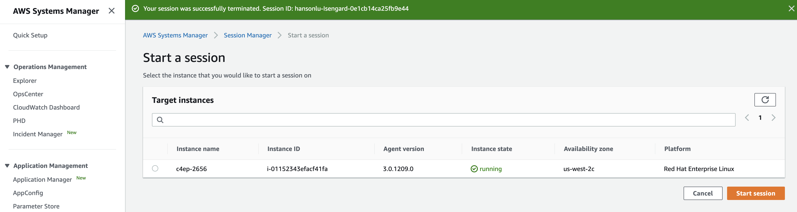
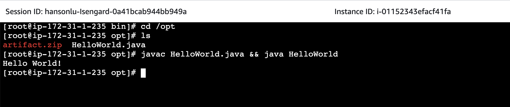

# terraform-simple-ec2

## usage

1. Instantiate Module
```
# this is an example
provider "aws" {
  region  = "us-west-2"
  profile = "malachi"
}

module "ec2" {
  source    = "./terraform-svb-ec2"
  name      = "c4ep-2656"
  vpc_id    = "vpc-7bcea503"
  subnet_id = "subnet-5a68bf07"
}
```
2. `terraform apply`

3. Wait for Instance to Boot and then Connect via Systems Manager: Session Manager


4. Navigate to folder where artifact was downloaded and run program.

